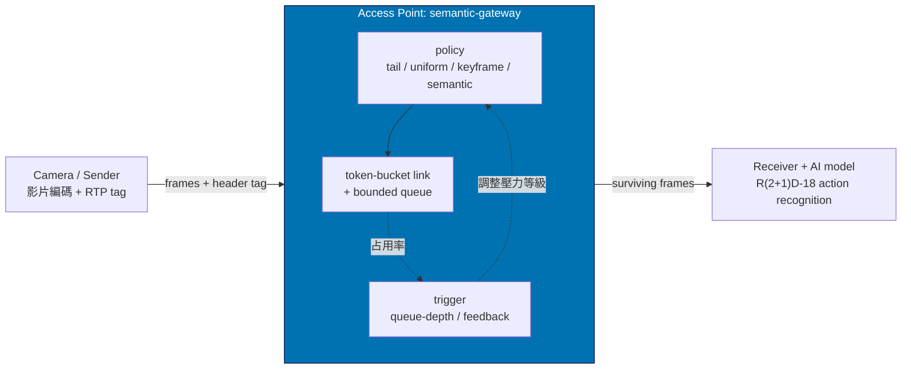
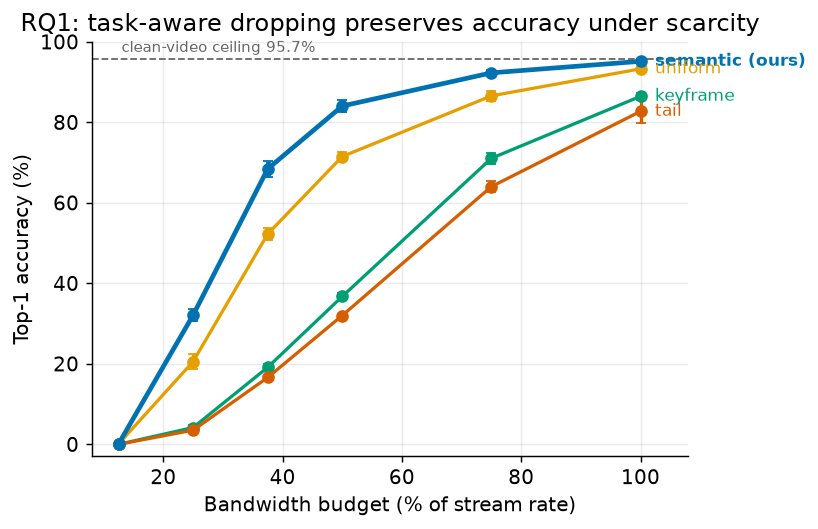
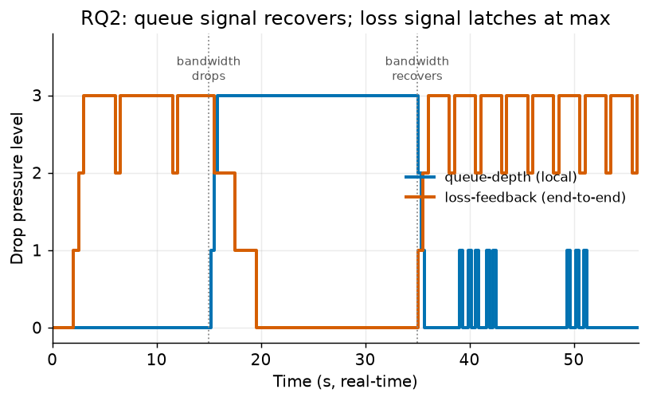
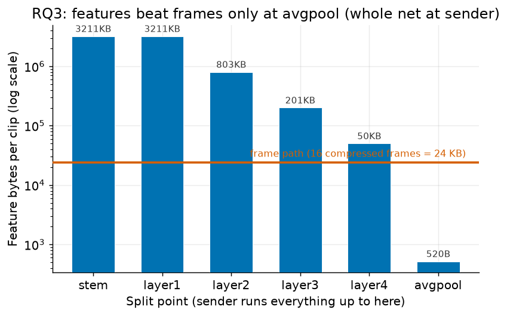

# Semantic Gateway 成果報告

# 前言

> [!NOTE]
> **這是 [wise-ntust/semantic-gateway](https://github.com/wise-ntust/semantic-gateway) 的成果報告，屬於毫米波計畫 in-network computing 這條線。建議閱讀順序：**
> 1. ***Semantic Gateway 成果報告***（本文件）
> 2. [README.md](./README.md)（專案定位與 roadmap）
> 3. [research/proposal.md](./research/proposal.md)（研究假設 H1 到 H5）
> 4. [research/plan.md](./research/plan.md)（實驗計畫：RQ、baseline、rigor budget）
> 5. [research/results.md](./research/results.md)（RQ 到數據的對照）
> 6. [software/README.md](./software/README.md)（程式碼與如何重現）
> 7. [software/IMPLEMENTATION_NOTES.md](./software/IMPLEMENTATION_NOTES.md)（工程決策與踩過的坑）

本報告涵蓋 semantic-gateway 第一階段（軟體）的完整成果。硬體階段（H4 ARM PS、H5 openwifi PL）尚未開始，列在未來工作。

## 系統全景



# 專案簡介

## 研究目的

> [!TIP]
> 影像分析管線把 camera 的畫面透過無線鏈路送到 AI 模型辨識。頻寬會因為使用者變多或 channel 變差而掉下來，這時一定要捨棄一些東西。
>
> 現在的 AP 是無腦捨棄：queue 滿了就 tail-drop 丟最後到的封包，完全不看內容。對 AI 來說，丟掉一個場景切換的 frame，和丟掉一個跟前一張幾乎一樣的冗餘 frame，代價天差地遠，但 AP 分不出來。結果是 accuracy 崩掉，不是因為丟太多，而是因為丟錯了。
>
> 在 AP 上直接轉碼（把 1080p 轉 720p）行不通：ZedBoard 的 Zynq-7020 沒有 video codec unit，fabric 又被 openwifi 佔掉大半。

> [!IMPORTANT]
> ***本研究的核心想法：讓 AP 從無腦轉發變成懂內容的轉發。frame 對 AI 的價值在 sender 端算好、寫進 RTP header，AP 只讀 header、由 link 層訊號觸發，就能做出對 AI 最無害的捨棄。運算搬到 sender，決策留在最早知道頻寬變化的 AP。***

## 與上一期 coding-gateway 的關係

| 專案 | 管什麼 | 方向 |
|---|---|---|
| [coding-gateway](https://github.com/wise-ntust/coding-gateway) | 傳得穩：多路徑 RLNC 編碼，遮斷下不中斷 | **增加**冗餘以對抗遺失 |
| **semantic-gateway** | 傳得值：頻寬受限時，對 AI 有價值的 bits 先走 | **移除**冗餘以對抗稀缺 |

## 四種捨棄策略（比較的對象）

| 策略 | 怎麼捨棄 | 定位 |
|---|---|---|
| `tail` | queue 滿就丟後到的封包 | naive baseline（現況 AP 行為） |
| `uniform` | 隨機抽稀，不看內容 | layer-blind baseline |
| `keyframe` | 保 I-frame、壓力下丟 P-frame | content-aware 但 task-blind（Gobatto 那派的近似） |
| **`semantic`** | sender 標記 temporal layer，AP 按層由高到低丟 | **task-aware（本研究）** |

# 系統設計

## 離線重播法

> [!NOTE]
> ***設計原則：把網路行為與 GPU 推論解耦，讓每個實驗完全可重現。***

網路行為只取決於封包的大小與時序，不需要真的搬 bitstream。因此：

1. sender 重播每個 frame 的真實編碼大小與 tag（payload 是 dummy bytes），走真實 UDP 管線
2. AP proxy 依 policy 決定每個 frame 收或丟，receiver 記錄哪些 frame 存活成 trace
3. trace 送到 king（RTX 3080）批次推論，用原始影片算 accuracy

好處：網路實驗不需要 GPU 即時推論，兩台機器各做擅長的事，且每個 run 的結果由 seed 完全決定。

## Decodability：單一事實來源

frame 之間有參考關係（hierarchical-P：I ← L0 ← L1 ← L2）。收到一個 frame，但它的參考祖先斷了，這個 frame 就不可用。

> [!IMPORTANT]
> ***semantic 按 temporal layer 由高到低丟，倖存的 frame 一定可解；tail / uniform 盲丟會打斷參考鏈，收到卻不可用。這個差距正是實驗要量的東西。***

## 頻寬與觸發訊號

- 頻寬由 proxy 的 token-bucket 模擬（這是模擬的無線鏈路速率，MCS 變化就是調它），AP 的 queue 深度依鏈路速率換算（預設 100ms）
- `queue` trigger：AP 看自己的 queue 占用率，超過門檻就升壓（本地、領先訊號）
- `feedback` trigger：AP 依 receiver 回報的 loss 升壓（端到端、落後訊號）

# 實驗一（RQ1）：捨棄策略 vs 頻寬預算

> [!NOTE]
> ***目的：同樣頻寬預算下，哪種捨棄策略保住最多 AI accuracy？（對應假設 H1）***

## 設定

- workload：UCF101 testlist01 分層抽樣 303 支影片（每類 3 支，涵蓋全部 101 類）
- 模型：R(2+1)D-18（Kinetics-400 預訓練，UCF101 fine-tune 到乾淨影片 95.7% top-1）
- 網格：4 policy × 6 頻寬預算 × 3 seed = 72 runs
- 預算 = AP 鏈路承載該影片串流位元率的比例

## 結果



top-1 accuracy（3 seed 平均 ± 標準差）：

| 預算 | **semantic（本研究）** | uniform | keyframe | tail |
|---:|:---:|:---:|:---:|:---:|
| 100% | **0.952 ± 0.005** | 0.933 | 0.865 | 0.827 |
| 75% | **0.923 ± 0.007** | 0.866 | 0.711 | 0.640 |
| 50% | **0.841 ± 0.015** | 0.715 | 0.367 | 0.320 |
| 37.5% | **0.684 ± 0.019** | 0.523 | 0.191 | 0.166 |
| 25% | **0.321 ± 0.015** | 0.206 | 0.042 | 0.035 |

> [!IMPORTANT]
> ***semantic 在 25% 到 100% 每個預算都贏，且超出誤差條。乾淨影片 95.7%，半頻寬下 semantic 只掉到 84.1%（少 11.6 個百分點），tail 崩到 32.0%。領先幅度在中頻寬最大：50% 預算領先次佳的 uniform 12.6 個百分點，37.5% 領先 16.1 個百分點，正是「丟什麼」最關鍵的區間。***

> [!TIP]
> 一個意外但關鍵的發現：keyframe（保 I-frame，content-aware）反而輸給隨機的 uniform。原因是只保 I-frame 等於每 32 張只留 1 張，動作辨識模型需要跨 frame 的時序資訊，被餓死了。這證明勝因是 **task-aware（知道 AI 要什麼）而不是 content-aware（只知道哪個 frame 重要）**，也正好和最接近的 prior work（Gobatto 那派）拉開區隔。

# 實驗二（RQ2）：觸發訊號 queue-depth vs loss-feedback

> [!NOTE]
> ***目的：頻寬變化時，AP 看自己的 queue 深度，還是等 receiver 回報 loss，哪個訊號驅動捨棄更好？（對應假設 H2）***

> [!WARNING]
> 這是 characterization，不是頭號結論。H2 從一開始就是最難在 emulation 裡測的假設：`tc netem` 給不出真的 link 層訊號（retry / MCS），完整比較留到 H5 上板。這裡能測的是兩種控制訊號的行為形狀。

## 設定

semantic policy 固定，只換 trigger。24 支影片、real-time、5 seed。頻寬排程：60 KB/s 在 t=15s 降到 18 KB/s，t=35s 回到 60 KB/s（一次壅塞再恢復）。

## 結果



| trigger | 頻寬充足時（0 到 15s） | 壅塞時（15 到 35s） | 恢復後（35s+） | level 變化次數 |
|---|:---:|:---:|:---:|:---:|
| **queue-depth** | **穩定在 0** | **升到 3（約 196ms）** | **回到約 0** | **16 到 24** |
| loss-feedback | 已經在 0↔3 震盪 | 約 2，仍在跳 | 持續 2↔3 震盪，回不到 0 | 75 到 83 |

> [!IMPORTANT]
> ***queue-depth 是乾淨的控制訊號：頻寬充足時待在 0，壅塞時約 196ms 內升壓，恢復後回到 0。loss-feedback 全程劇烈震盪（連壅塞前頻寬充足時都在跳），恢復後也回不到無壓力狀態。***

> [!CAUTION]
> loss-feedback 不穩的原因是本質的，不是調參問題：receiver 的 loss 估計分不清三件事，AP 自己的語意丟棄、I-frame 突發造成的暫時遺失、真正的壅塞。任何一種都被讀成 loss，所以 loss 驅動的控制器會追著自己的尾巴跑。queue 占用率反映真實積壓，不受 policy 丟棄干擾，所以有穩定的操作點。

# 實驗三（RQ3）：傳 frame vs 傳 feature

> [!NOTE]
> ***目的：同樣頻寬預算下，傳捨棄後的 frame 好，還是傳從 frame 抽出的 feature 好？crossover 在哪？（對應假設 H3）***

## 設定

把 fine-tune 好的 R(2+1)D-18 在 6 個 split point 切開，sender 跑前半、feature 經 int8 量化過鏈路、receiver 跑後半。frame path 的對照：傳一個 16-frame clip 的原始編碼 frame（平均每 frame 1512 bytes，一個 clip 共 24 KB）。

## 結果



| split point | feature bytes/clip | 對比 frame clip（24 KB） | top-1 |
|---|---:|:---:|:---:|
| stem | 3,211 KB | 大 133 倍 | 0.951 |
| layer2 | 803 KB | 大 33 倍 | 0.951 |
| layer3 | 201 KB | 大 8.3 倍 | 0.951 |
| layer4 | 50 KB | 大 2.1 倍 | 0.951 |
| **avgpool** | **520 B** | **小 47 倍** | 0.951 |

> [!IMPORTANT]
> ***H3 不成立。只要 split 淺到讓 AP 端還有意義的運算（stem 到 layer4），feature 都比壓縮後的 frame 大，沒有任何頻寬預算會讓 feature path 贏。feature 唯一變小的點是 avgpool（520 bytes），但那等於把整個網路搬到 sender，是 edge inference 不是 AP in-network computing。***

> [!TIP]
> 根因：x264 這種現代 codec 靠時間冗餘把 frame 壓得極小（P-frame 約 1.3 KB），naive int8 量化的 CNN 中間層 activation 拿不到這個好處。int8 量化本身幾乎不掉 accuracy（各 split 都 0.951）。這個負結果反而收緊了故事：價值在 AP 做 task-aware 捨棄，不在 AP 抽 feature。

# 完整重現

> [!NOTE]
> 三台機器：king（RTX 3080，模型與推論）、sandbox（Linux netns 測試床）、開發機。程式碼在 [software/](./software/)。

## 環境

```bash
# 模型側（king, Windows + Python 3.13）
python -m venv venv && venv\Scripts\pip install torch torchvision av numpy --index-url https://download.pytorch.org/whl/cu126
# 管線側（sandbox, Linux）
cd software && pip install -e .[test] && pytest   # 15 tests
```

## 建資料與模型（king）

```powershell
# 每支影片的 frame 大小 + diff score + temporal layer
python model\prepare_manifests.py --ucf-dir ...\UCF-101 --split-file ...\testlist01.txt --out manifests_test01.jsonl --workers 8
# 分層抽樣子集（實驗用，涵蓋全部 101 類）
python model\subset_manifests.py --in manifests_test01.jsonl --out manifests_strat3.jsonl --per-class 3 --seed 0
# 一個凍結的 checkpoint，所有實驗共用
python model\finetune.py --ucf-dir ...\UCF-101 --splits-dir ...\ucfTrainTestlist --out-dir ckpt --epochs 12
```

## 跑實驗（sandbox）

> [!CAUTION]
> 網路實驗要先把 netns 測試床拉起來（`ip netns exec` 需要 root），不然 run.sh 會退回 localhost，AP 的多介面路由（feedback 訊號）會不通。先 `sudo ./testbed/netns.sh up`，跑完 `sudo ./testbed/netns.sh down`。

```bash
sudo ./testbed/netns.sh up
# RQ1：policy x budget x seed 掃描
sudo ./experiments/run.sh ~/manifests_strat3.jsonl /tmp/rq1 \
  --policies "semantic tail uniform keyframe" \
  --budgets "1.0 0.75 0.5 0.375 0.25 0.125" --seeds "0 1 2"
```

## 算 accuracy 與彙整（king）

```powershell
python model\eval_all.py --runs-dir rq1 --manifests manifests_strat3.jsonl --ucf-dir ...\UCF-101 --splits-dir ...\ucfTrainTestlist --ckpt ckpt\r2plus1d18_ucf101_seed0.pt
python model\aggregate.py --results rq1\results.json   # mean +/- std across seeds
```

每個 run 目錄自帶 `env.txt`（host、git SHA、版本）、`*.run.json`（argv）、原始 `events.jsonl` / `trace.jsonl`、`summary.json`。報告裡每個數字都能追到一個 run 目錄。

# 誠實邊界

> [!WARNING]
> 這些是本階段**沒有**驗證到、或明確受限的地方，列出來是可信度的來源：
>
> - **只到軟體 emulation**：頻寬用 token-bucket 模擬，`tc netem` 只加傳播延遲，沒有真的 retry / MCS / channel 動態。RQ2 的 adapt_ms 在 emulation 裡偏吵，不宣稱精確倍數。硬體驗證（H4 ARM PS、H5 openwifi PL）尚未開始。
> - **編碼是模型假設**：x264 出的是 IPPP，不是真的 hierarchical-P；frame 大小取自真實編碼，但參考結構（GOP 32、4-frame 階層）是我們定義的。低延遲串流 bframes=0，所以沒有 B-frame 可丟。
> - **單一任務、單一模型**：只測 UCF101 動作辨識 + R(2+1)D-18。其他任務（偵測、分割）或更吃 / 不吃時序的模型，結論可能不同。
> - **RQ2 的 feedback baseline 是說明用途**，不是調校過的 production 控制器；它的不穩定說明了為什麼本地訊號較好，但公平的最終比較需要硬體。

# 結論

> [!IMPORTANT]
> ***在頻寬受限的 AP 上做 task-aware、依 temporal layer 結構的捨棄（semantic），比盲丟（tail）、抽稀（uniform）、或 content-aware 但 task-blind（keyframe）都能保住明顯更多 AI accuracy，領先幅度在中頻寬達 12 到 16 個百分點。價值在 AP 端的智慧捨棄，不在 AP 端抽 feature。***

三個假設的狀態：

- **H1（semantic drop）**：強力成立，頭號結果
- **H2（觸發訊號）**：部分成立（characterization）。queue-depth 穩定且會自我修正，loss-feedback 因訊號混淆而不穩。方向成立，精確比較留 H5
- **H3（frame vs feature）**：不成立（誠實負結果）。傳壓縮 frame 全面勝，收緊了 AP 端捨棄的定位

## 未來工作

1. **H4：ARM PS 上板**。ZedBoard 的 ARM 端讀 RTP header 做 layer 捨棄，量 per-packet overhead，作為 H5 前哨
2. **H5：openwifi PL 上板**。把捨棄決策放進 openwifi TX datapath 的 FPGA（直讀 queue / retry / MCS），量資源（估 < 2K LUTs）與 throughput，這才是真正的 link 層訊號 RQ2
3. **更多任務與模型**：偵測 / 分割，驗證結論的普遍性
4. **redundancy elimination**：封包內去重，接在捨棄之前進一步縮小傳輸量

# Reference

> [!WARNING]
> - Repo：[wise-ntust/semantic-gateway](https://github.com/wise-ntust/semantic-gateway)
> - 上一期：[wise-ntust/coding-gateway](https://github.com/wise-ntust/coding-gateway)
> - Dataset：[UCF101](https://www.crcv.ucf.edu/data/UCF101.php)
> - 最接近的 prior work：Gobatto et al., "Improving Content-Aware Video Streaming in Congested Networks with In-Network Computing" (arXiv:2202.04703)
> - 實驗數據：[research/experiments/](./research/experiments/)（每個 RQ 一個目錄，含 raw traces 與 env 快照）
